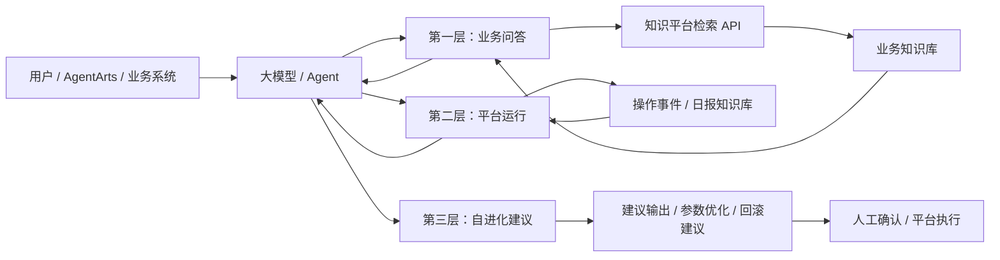
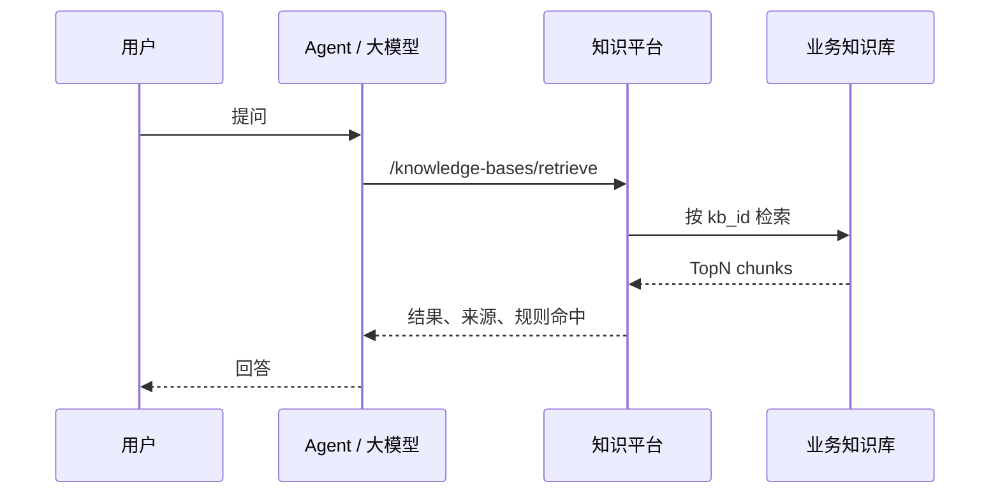
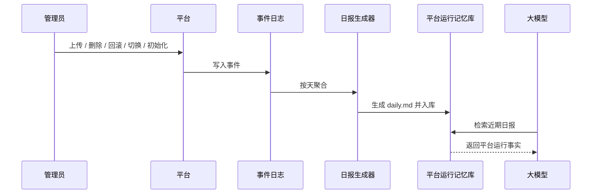
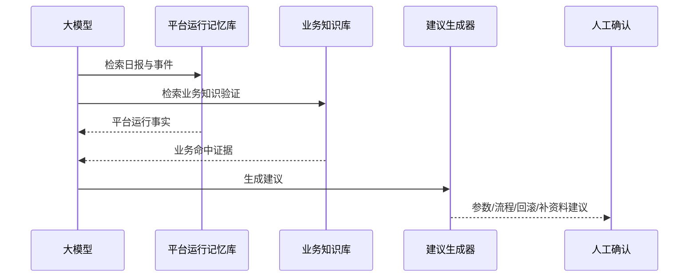
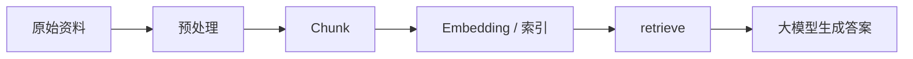
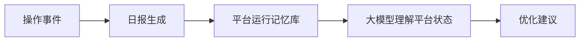
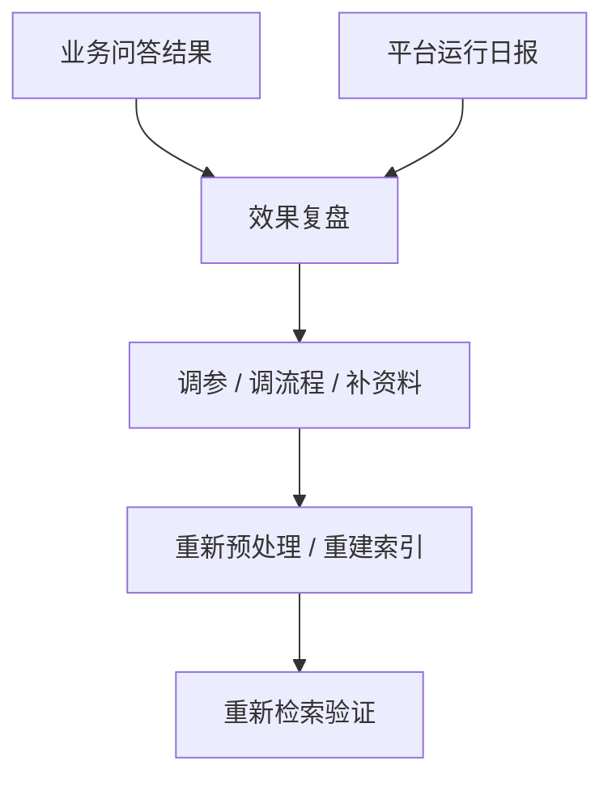

# 大模型接入接口清单与数据流图

## 1. 目标

本文档是在《大模型接入知识平台方案》基础上，进一步细化大模型接入知识平台时需要用到的接口清单、数据流和推荐边界。

文档重点回答三个问题：

1. 大模型接入时要调用哪些接口。
2. 请求和返回的数据如何流转。
3. 业务问答、平台运行、自进化建议三层如何串起来。

## 2. 接入总览

## 3. 接口分层清单

### 3.1 平台基础接口

这组接口用于平台状态查询、知识库注册和当前激活库识别。

| 接口 | 方法 | 用途 | 调用方 |
|---|---|---|---|
| `/health` | `GET` | 返回平台健康状态、当前激活知识库、模型信息 | 平台前端 / Agent / 运维 |
| `/knowledge-base-registry` | `GET` | 获取知识库注册表 | 平台管理页 / 运维 |
| `/knowledge-base-registry` | `POST` | 新增或更新知识库元数据 | 平台管理页 / 运维 |
| `/knowledge-base-registry/{kb_id}` | `PUT` | 修改指定知识库元数据 | 平台管理页 / 运维 |
| `/knowledge-base-registry/{kb_id}` | `DELETE` | 删除知识库条目 | 平台管理页 / 运维 |
| `/knowledge-base-registry/{kb_id}/activate` | `POST` | 切换当前激活知识库 | 平台管理页 / 运维 |
| `/knowledge-base-registry/{kb_id}/initialize` | `POST` | 初始化知识库目录和默认配置 | 平台管理页 / 运维 |

### 3.2 业务问答接口

这组接口是大模型对外问答的主入口。

| 接口 | 方法 | 用途 | 调用方 |
|---|---|---|---|
| `/knowledge-bases/retrieve` | `POST` | 按当前激活知识库或显式 `knowledge_base_ids` 检索 | AgentArts / 业务 Agent / 前端 |
| `/knowledge-bases` | `GET` | 查看知识库列表和文档统计 | 平台前端 / Agent |

### 3.3 原始文件与流程接口

这组接口用于平台运行层和新库初始化。

| 接口 | 方法 | 用途 | 调用方 |
|---|---|---|---|
| `/raw-files` | `GET` | 查看原始文件列表 | 平台前端 / 运维 |
| `/raw-files/upload` | `POST` | 上传原始文件 | 平台前端 / 运维 |
| `/raw-files` | `DELETE` | 删除原始文件 | 平台前端 / 运维 |
| `/raw-files/rollback` | `POST` | 回滚原始文件上一版 | 平台前端 / 运维 |
| `/raw-files/pipeline` | `GET` | 查询预处理流水线状态 | 平台前端 / 运维 |
| `/raw-files/pipeline` | `POST` | 触发预处理 / chunk / embedding | 平台前端 / 运维 |
| `/pipeline-config` | `GET` | 读取流程配置 | 平台前端 / 运维 |
| `/pipeline-config` | `PUT` | 保存流程配置 | 平台前端 / 运维 |

## 4. 第一层：业务问答层接口流

### 4.1 请求流

### 4.2 推荐请求字段

`/knowledge-bases/retrieve` 建议使用的请求字段：

| 字段 | 说明 |
|---|---|
| `knowledge_base_id` | 优先检索的知识库 ID |
| `knowledge_base_ids` | 可选，显式限定检索范围 |
| `query` | 用户问题 |
| `method` | 当前为 `doc` |
| `offset` | 分页偏移 |
| `limit` | 返回条数 |
| `top_k` | 召回候选数 |
| `search_threshold` | 最低命中阈值 |
| `extra_params` | 预留扩展参数 |

### 4.3 推荐返回字段

`search_result_list` 中建议保留：

| 字段 | 说明 |
|---|---|
| `knowledge_base_id` | 来源知识库 |
| `file_id` | 文档 ID |
| `chunk_id` | chunk ID |
| `title` | 标题 |
| `content` | 片段内容 |
| `score` | 总分 |
| `keyword_score` | 关键词得分 |
| `embedding_score` | 向量得分 |
| `rule_score` | 规则得分 |
| `matched_rules` | 命中的规则 |
| `retrieval_mode` | 检索模式 |
| `doc_type` | 文档类型 |
| `folder` | 目录 |
| `version` | 文档版本 |
| `section_path` | 章节路径 |
| `source_file` | 原始文件路径 |
| `selected_md` | selected 文档路径 |

### 4.4 这一层的边界

业务问答层只负责“查知识并返回证据”，不负责：

- 自动修改配置
- 自动重建索引
- 自动触发回滚
- 自动写生产数据

这些动作必须进入平台运行层或人工确认流程。

检索契约的详细字段、兼容规则和返回结构，见：[知识平台检索接口契约.md](/Users/chenzhuo/hb/knowledge_base/docs/知识平台检索接口契约.md)。

## 5. 第二层：平台运行层接口流

### 5.1 请求流

### 5.2 推荐事件接口

当前平台侧建议统一沉淀这些事件：

- `upload`
- `delete`
- `rollback`
- `initialize`
- `activate`
- `config_update`
- `preprocess`
- `chunk`
- `embedding`
- `index_build`
- `publish`
- `rebuild`

### 5.3 运行层返回给大模型的内容

平台运行层建议返回的是“事实摘要”，包括：

- 今天做了什么
- 哪些任务成功 / 失败
- 哪些知识库被切换
- 哪些目录初始化完成
- 哪些配置被修改
- 哪些文件回滚或删除

### 5.4 这一层的边界

平台运行层的目标是“让大模型理解平台状态”，不是让模型直接执行生产操作。

## 6. 第三层：自进化建议层接口流

### 6.1 请求流

### 6.2 建议输出结构

建议输出可采用如下结构：

| 字段 | 说明 |
|---|---|
| `suggestion_type` | 参数调优 / 回滚 / 补资料 / 目录调整 / 规则修订 |
| `summary` | 简述 |
| `reason` | 产生建议的原因 |
| `evidence` | 证据来源 |
| `impact_scope` | 影响范围 |
| `risk` | 风险提示 |
| `priority` | 优先级 |
| `needs_human_approval` | 是否需要人工确认 |

### 6.3 这一层的边界

这一层只输出建议，不直接改生产数据。  
建议必须经过人工确认或任务编排后再执行。

## 7. 推荐数据流

### 7.1 业务知识流

### 7.2 平台运行流

### 7.3 闭环流

## 8. 最小可落地接口组合

如果要先做最小闭环，建议先打通以下接口组合：

1. `/knowledge-bases/retrieve`
2. `/knowledge-base-registry`
3. `/health`
4. `daily.md` 生成器
5. 平台运行记忆库检索接口

这五个能力先起来，就能实现：

- 业务问答可用
- 平台状态可读
- 日报可查
- 运行记忆可积累
- 后续优化建议可生成

## 9. 接入建议

### 9.1 对 AgentArts

AgentArts 作为首个外部消费者，建议优先接业务问答层：

- 统一配置知识平台地址
- 使用 `retrieve` 获取证据
- 保留引用和来源
- 根据 `knowledge_base_id` 路由不同知识库

### 9.2 对平台自身

平台内部先把事件和日报跑起来，再把日报送入平台运行记忆知识库。

### 9.3 对未来自进化

未来如果要做自动优化，可以在建议层上叠加：

- 参数推荐
- 重建建议
- 资料补齐建议
- 规则修订建议

## 10. 结论

大模型接入知识平台，建议采用“三层接口 + 双知识库”的方式：

- 业务问答层：对外提供问答能力
- 平台运行层：对内理解平台状态
- 自进化建议层：输出优化建议

配套上再区分：

- 业务知识库
- 平台运行记忆库

这样可以把知识平台真正做成一个可持续闭环系统，而不是只会检索的工具。
