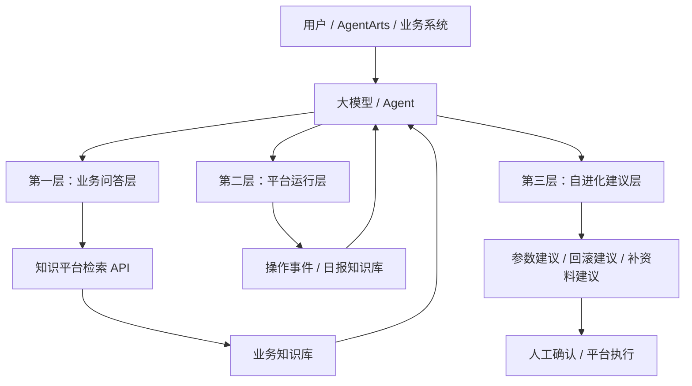

# 大模型接入知识平台方案

## 1. 目标

本方案用于说明大模型如何接入知识平台，并把接入能力拆成三层：

- 业务问答层
- 平台运行层
- 自进化建议层

目标不是让大模型直接读取平台底层文件，而是让平台以统一 API 和统一知识库的方式为大模型提供可控、可追溯、可审计的知识能力。

## 2. 接入原则

### 2.1 平台提供能力，模型负责理解

知识平台负责：

- 原始文件管理
- 版本管理
- 预处理、chunk、embedding、索引构建
- 检索服务
- 操作日志
- 日报生成
- 运行记忆入库

大模型负责：

- 读取检索结果
- 结合上下文生成答案
- 读取日报和事件总结平台状态
- 输出优化建议和复盘建议

### 2.2 不直连文件系统

大模型或 Agent 不应直接访问底层目录，而应通过统一 API 或专用知识库检索接口访问平台能力。

### 2.3 业务知识与平台运行知识分离

建议将知识分成两类：

- 业务知识库：用于回答实际业务问题
- 平台运行记忆库：用于理解平台运行状态、变更和优化建议

这样可以避免业务知识和运维知识互相污染。

### 2.4 所有接入都显式指定知识库

请求都应尽量显式携带 `knowledge_base_id`，避免默认串库。

## 3. 三层接入结构

## 4. 第一层：业务问答层

### 4.1 定位

这一层面向真实业务问答，例如：

- 危化品车现场如何处理
- 拥堵如何判断和处置
- 违规收银的规则是什么
- 某个制度的依据是什么

它是大模型对外提供答案的主路径。

### 4.2 接入方式

大模型或 Agent 先调用知识平台检索接口，再基于返回结果生成答案。

典型流程：

1. 用户提问
2. Agent 识别知识库或场景
3. 调用 `/knowledge-bases/retrieve`
4. 平台返回 TopN 结果、来源、版本、规则命中情况
5. 大模型基于证据生成回答
6. 回答中保留引用来源

### 4.3 平台返回给大模型的关键信息

建议返回以下内容：

- `title`
- `content`
- `score`
- `retrieval_mode`
- `matched_rules`
- `doc_type`
- `folder`
- `version`
- `section_path`
- `source_file`
- `selected_md`

这些字段能让大模型回答时具备来源感和可解释性。

### 4.4 这一层的边界

这一层只回答业务问题，不负责平台运行复盘，也不负责自动改平台配置。

## 5. 第二层：平台运行层

### 5.1 定位

这一层面向“平台自己怎么运行”的问题，核心是让大模型理解：

- 今天上传了什么
- 今天跑了哪些预处理
- 今天哪些任务失败了
- 今天做了哪些切库和初始化
- 今天哪些配置变了
- 今天哪些文件发生了回滚或删除

### 5.2 载体

建议使用两类载体：

- 结构化操作事件日志
- 每日汇总 `.md`

其中，`.md` 是给人和模型共同阅读的主载体。

### 5.3 接入方式

1. 平台记录操作事件
2. 每天自动汇总生成 `daily/YYYY-MM-DD.md`
3. 日报自动进入“平台运行记忆”知识库
4. 大模型在需要时通过检索读取最近日报
5. 大模型总结平台当前状态和异常趋势

### 5.4 能回答什么

这一层的大模型可回答的问题包括：

- 今天知识平台做了哪些更新
- 哪些流程失败最多
- 哪些知识库目前为空
- 哪些目录初始化完成了
- 哪些参数最近被修改过
- 哪些任务需要重跑

### 5.5 这一层的边界

这一层只做“理解和总结”，不直接修改生产数据。  
如果要改配置、重跑任务或回滚，仍然由人确认后再执行。

## 6. 第三层：自进化建议层

### 6.1 定位

这一层不直接生成业务答案，而是基于业务检索结果和平台运行历史，输出平台优化建议。

### 6.2 可输出的建议类型

- 参数调优建议
- chunk 方案调整建议
- embedding 模型切换建议
- 目录范围调整建议
- 文件补齐建议
- 回滚建议
- 规则修订建议
- 失败任务重跑建议

### 6.3 输入来源

这一层可以同时读取：

- 业务知识库的检索结果
- 平台运行记忆知识库的日报
- 操作事件摘要
- 回归测试结果

### 6.4 输出形式

建议输出为结构化建议，而不是直接执行命令。

建议格式包括：

- 建议项
- 建议原因
- 影响范围
- 风险提示
- 推荐执行顺序
- 是否需要人工确认

### 6.5 这一层的边界

这一层是“建议层”，不是“执行层”。  
平台可以采纳建议，但最终动作应进入审批、确认或任务编排流程。

## 7. 平台与 AgentArts 的衔接

### 7.1 推荐接法

AgentArts 作为第一个外部消费者，建议接在业务问答层。

流程建议如下：

1. AgentArts 调用知识平台统一检索接口
2. 知识平台按当前激活知识库或显式 `knowledge_base_id` 检索
3. 返回检索结果和引用信息
4. AgentArts 负责最终回答生成

### 7.2 建议保留的能力

- 统一检索 API
- 知识库注册表
- 当前激活知识库
- 多知识库隔离
- 检索结果的引用与来源

### 7.3 未来扩展

后续如果还要接其他平台，可以继续复用同一套检索层和运行记忆层，只需要增加新的 adapter。

## 8. 推荐的数据与接口边界

### 8.1 业务问答层

- 输入：用户问题、知识库 ID、场景标签
- 输出：检索结果、引用、答案

### 8.2 平台运行层

- 输入：操作日志、任务状态、日报
- 输出：平台状态摘要、异常摘要、变更摘要

### 8.3 自进化建议层

- 输入：业务结果、日报、回归结果、失败记录
- 输出：优化建议、回滚建议、调参与重建建议

## 9. 推荐落地顺序

建议按照下面顺序实施：

1. 先让业务问答层稳定接入 AgentArts。
2. 再把操作事件和日报接入平台运行层。
3. 再把日报喂给“平台运行记忆”知识库。
4. 最后在自进化建议层做参数优化和流程优化建议。

## 10. 结论

大模型接入知识平台，最稳的方式不是直接读文件，而是通过三层结构逐步接入：

- 第一层做业务问答
- 第二层做平台运行理解
- 第三层做自进化建议

这样既能满足当前 AgentArts 的对接需求，也能为后续的平台化和自动优化留下空间。

