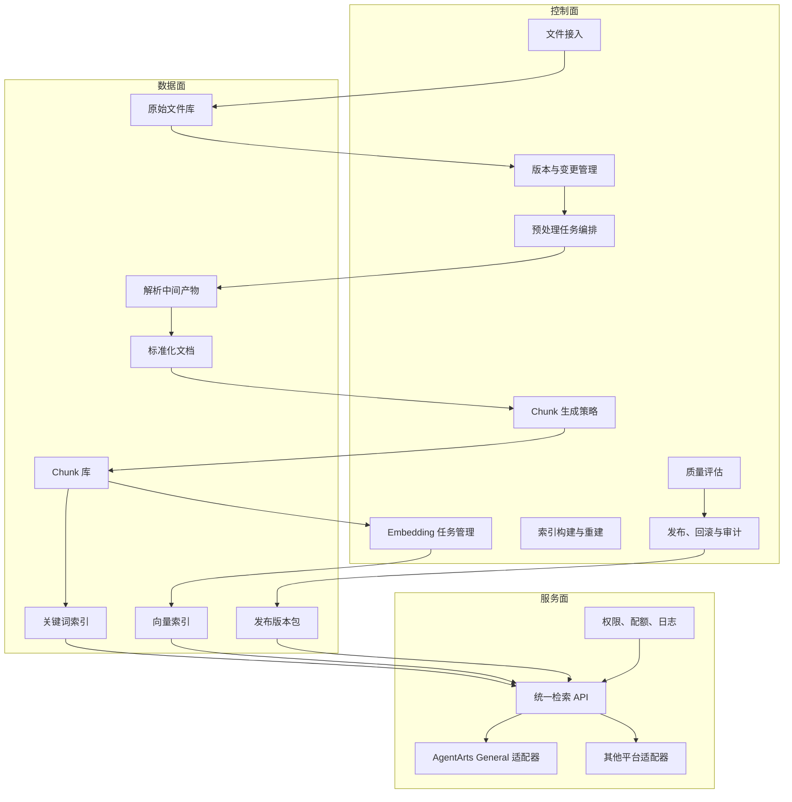
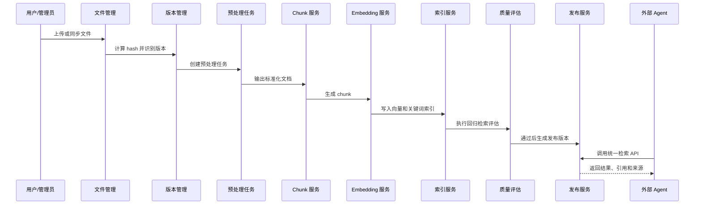

# 知识平台建设方向说明书

## 1. 平台定位

本项目建议正式定义为“知识平台建设”，而不是单一的“向量库建设”或“知识库导入工具”。

平台的核心目标是把原始文件、版本管理、文档预处理、chunk 生成、embedding、索引构建、检索发布和外部平台接入串成一条可持续运行的知识资产生产线。

未来该平台不仅服务 `AI+智能问答智能体`，也要支持其他 Agent、业务系统、运营平台、项目管理工具和第三方智能体平台调用。因此，平台设计必须保证外部接口稳定、内部能力可替换、发布版本可回溯、检索结果可解释。

## 2. 建设目标

| 目标 | 说明 |
|---|---|
| 知识资产可管理 | 原始文件、版本、来源、适用范围、状态、责任人统一管理 |
| 文件更新可追踪 | 支持新增、替换、废止、回滚和变更影响分析 |
| 处理流程可编排 | 预处理、解析、切块、embedding、索引构建支持任务化执行 |
| 知识版本可发布 | 每次发布形成独立版本包，可回滚、可灰度、可审计 |
| 检索能力可复用 | 对外提供统一检索服务，支持多个平台和 Agent 调用 |
| 内部能力可扩展 | 解析器、embedding 模型、向量库、检索策略、rerank 均可替换 |
| 结果来源可追溯 | 每条检索结果可回到文档、版本、章节、chunk、来源文件 |

## 3. 总体架构

## 4. 核心设计原则

### 4.1 对外接口稳定

外部平台不直接依赖内部解析器、向量库或目录结构，只通过统一 API 消费知识。

当前 AgentArts 可通过 `General` 适配器接入，未来其他平台只需要新增 adapter，不改核心知识平台。

### 4.2 内部模型统一

平台内部建立 canonical schema，统一描述文件、文档版本、chunk、索引、检索结果和发布版本。

AgentArts、RAGFlow、内部 Agent 或其他业务系统的字段差异，都在 adapter 层处理。

### 4.3 发布版本可回溯

每次发布都形成独立版本，记录：

| 类型 | 示例 |
|---|---|
| 文件版本 | 原始文件 hash、业务版本号、有效状态 |
| 解析版本 | 解析器名称、解析器版本、解析配置 |
| chunk 版本 | 切块策略、chunk 参数、chunk hash |
| embedding 版本 | 模型名称、模型版本、向量维度 |
| 索引版本 | 向量库版本、关键词索引版本、构建时间 |
| 发布版本 | 发布人、发布时间、发布范围、回滚点 |

### 4.4 检索能力可插拔

检索层建议抽象为统一接口，内部支持多种策略组合：

| 策略 | 作用 |
|---|---|
| 关键词检索 | 命中制度编号、专业术语、精确短语 |
| 向量检索 | 命中语义相近问题和自然语言问法 |
| 混合检索 | 综合关键词和语义召回 |
| Rerank | 对候选结果重新排序，提高最终命中质量 |

### 4.5 治理优先于向量化

文档版本、来源、适用范围、废止状态和权限级别不清楚时，不应直接进入生产索引。

平台应先保证“哪些知识能用、谁负责、是否有效”，再追求检索效果。

## 5. 平台模块

| 模块 | 核心能力 | 第一阶段重点 |
|---|---|---|
| 文件管理 | 上传、批量导入、目录分类、hash 去重 | 支持本地和 OSS/MinIO 文件接入 |
| 版本管理 | 文件版本、有效状态、废止、回滚 | 建立文档主数据和版本状态 |
| 预处理编排 | MinerU、Marker、MarkItDown 调度 | MinerU 主线，Marker 抽样，MarkItDown 补 DOCX |
| 结构化文档 | 标准化 Markdown、表格、章节、页码 | 保留标题、章节和来源路径 |
| Chunk 生成 | 按标题、条款、表格、段落切块 | 替代纯固定长度切块 |
| Embedding | 批量向量化、模型版本管理 | 支持本地模型或云模型切换 |
| 索引管理 | 向量索引、关键词索引、增量重建 | 先跑通版本化索引 |
| 质量评估 | 解析质量、召回质量、回归题库 | 建立 30-50 个回归问题 |
| 发布管理 | 发布、回滚、灰度、版本冻结 | 每个发布版本可审计 |
| 检索服务 | 统一 API、引用返回、权限过滤 | 兼容 AgentArts General |
| Adapter | AgentArts、其他平台接入 | 先实现 AgentArts，预留通用接口 |
| 运维审计 | 日志、调用统计、反馈闭环 | 记录 API 调用和命中结果 |

## 6. 关键数据模型

### 6.1 Document

| 字段 | 说明 |
|---|---|
| doc_id | 文档唯一 ID |
| title | 文档标题 |
| source_file | 原始文件路径或对象存储地址 |
| file_hash | 文件 hash，用于去重和变更识别 |
| version | 文档业务版本 |
| status | draft、active、deprecated、archived |
| domain | 知识域 |
| owner | 业务责任人 |
| effective_date | 生效日期 |
| scope | 适用范围 |
| confidentiality | 权限级别 |

### 6.2 Chunk

| 字段 | 说明 |
|---|---|
| chunk_id | chunk 唯一 ID |
| doc_id | 所属文档 |
| doc_version | 文档版本 |
| section_path | 章节路径 |
| page_no | 页码或页码范围 |
| text | chunk 文本 |
| chunk_hash | chunk 内容 hash |
| token_count | token 数 |
| metadata | 扩展元数据 |

### 6.3 Index Version

| 字段 | 说明 |
|---|---|
| index_id | 索引版本 ID |
| batch_id | 构建批次 |
| embedding_model | embedding 模型 |
| embedding_version | 模型版本 |
| vector_store | 向量库类型 |
| keyword_store | 关键词索引类型 |
| chunk_strategy | 切块策略版本 |
| status | building、testing、released、rollback |

## 7. 端到端流程

## 8. 实现路径

### Phase 1：平台基础版

目标：把当前脚本能力平台化，形成可管理、可重复执行的生产线。

交付内容：

| 工作 | 说明 |
|---|---|
| 文件主数据 | 建立文档清单、hash、版本、状态 |
| 任务编排 | 支持预处理、chunk、embedding、索引构建任务 |
| 基础存储 | PostgreSQL 管元数据，OSS/MinIO 管文件 |
| API 服务 | FastAPI 提供检索和管理接口 |
| AgentArts 适配 | 保留当前 General 接口 |

### Phase 2：检索增强版

目标：提升问答命中率和可解释性。

交付内容：

| 工作 | 说明 |
|---|---|
| 结构化 chunk | 按章节、条款、表格和语义边界切块 |
| 向量检索 | 引入中文 embedding 模型 |
| 关键词检索 | 建立 BM25 或全文检索 |
| 混合检索 | 合并关键词召回和向量召回 |
| Rerank | 对候选结果二次排序 |

### Phase 3：发布与治理版

目标：平台可以支持生产发布、回滚和多消费者接入。

交付内容：

| 工作 | 说明 |
|---|---|
| 版本冻结 | 每次发布形成独立版本 |
| 发布管理 | 支持测试、预发、生产环境 |
| 回滚机制 | 支持回退到历史索引版本 |
| 权限过滤 | 按知识域、角色、调用方过滤 |
| 调用审计 | 记录调用方、query、命中结果和反馈 |

### Phase 4：规模化运营版

目标：支持多知识域、多 Agent、多平台长期运营。

交付内容：

| 工作 | 说明 |
|---|---|
| 多租户 | 支持不同项目或业务域隔离 |
| 增量更新 | 文件变更后只重建受影响索引 |
| 反馈闭环 | 根据用户反馈优化 chunk、标签和检索策略 |
| 效果看板 | 展示命中率、无结果率、热门问题、低分结果 |
| 多 adapter | 接入 AgentArts、内部 Agent、业务系统和其他平台 |

## 9. 与当前已完成能力的关系

当前已经完成的能力可以作为平台 MVP 的原型底座：

| 当前能力 | 平台化改造方向 |
|---|---|
| raw 文件目录 | 升级为文件管理和版本管理模块 |
| MinerU / MarkItDown 预处理脚本 | 升级为预处理任务编排 |
| selected 文档 | 升级为标准化文档版本 |
| chunks.jsonl | 升级为 chunk 库和 chunk 版本 |
| TF-IDF 向量检索 | 升级为 hybrid 检索的关键词基线 |
| kb-api | 升级为统一检索 API 和 adapter 服务 |
| AgentArts General 接口 | 保留为第一个外部适配器 |

## 10. 近期建议决策

| 决策项 | 建议 |
|---|---|
| 平台名称 | 知识平台或知识资产平台 |
| 第一阶段范围 | 文件管理、版本管理、预处理、chunk、embedding、索引、检索 API |
| 外部接入 | AgentArts General 作为第一个 adapter |
| 存储底座 | PostgreSQL + OSS/MinIO |
| 任务底座 | Celery + Redis |
| 检索底座 | 先保留当前 TF-IDF，对接 embedding 后升级 hybrid |
| 部署方式 | Docker Compose 起步，后续按规模迁移到 K8s |

## 11. 参考资料

- [Huawei Cloud AgentArts General 知识库接入](https://support.huaweicloud.com/usermanual-agentarts0/agentarts_05_0245.html)
- [Huawei Cloud AgentArts 第三方通用知识库接入规范](https://support.huaweicloud.com/usermanual-agentarts0/agentarts_05_0246.html)
- [FastAPI 官方文档](https://fastapi.tiangolo.com/)
- [PostgreSQL 官方文档](https://www.postgresql.org/docs/)
- [pgvector 官方仓库](https://github.com/pgvector/pgvector)
- [Milvus 官方文档](https://milvus.io/docs)
- [Redis 官方文档](https://redis.io/docs/latest/)
- [Celery 官方文档](https://docs.celeryq.dev/)
