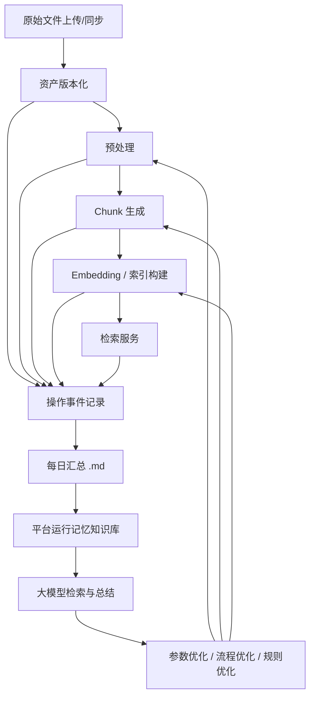
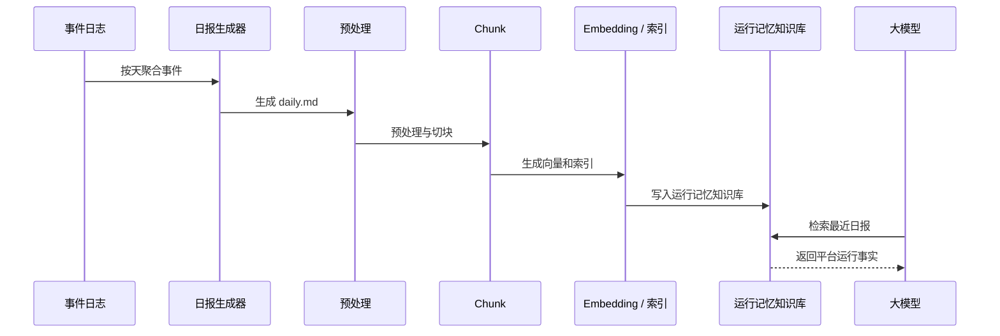

# 知识平台闭环与自进化方案

## 1. 方案目标

本方案的目标，是把当前知识平台从“原始文件处理 + 向量检索工具”，升级为一个可持续运行的知识资产闭环平台，使其同时具备以下能力：

- 资产可追溯：原始文件、中间产物、索引、配置都能查到来源和历史版本。
- 操作可回放：上传、预处理、chunk、embedding、切库、回滚、删除、初始化等每一次操作都可审计。
- 日报可理解：平台每天自动生成一份 `.md` 汇总，既给人看，也给大模型读。
- 平台可自进化：大模型能够基于历史操作和日报，持续理解平台状态、异常趋势和优化方向。

本方案不只是“记录更多日志”，而是把平台变成一个可以被人和模型共同理解的知识生产系统。

## 2. 总体原则

### 2.1 统一资产视角

所有产物都应视为“资产”，并纳入版本管理。资产不仅包括原始文件，还包括：

- 预处理输出
- 标准化文档
- selected 文档
- chunk 结果
- embedding 文件
- 向量索引
- 关键词索引
- 配置文件
- 规则文件
- 发布包
- 验证结果

### 2.2 统一事件视角

所有操作都应视为“事件”。每次操作都记录一条结构化事件，便于后续聚合、回放、审计和分析。

### 2.3 统一知识视角

日报不是普通日志，而是平台运行知识的一部分。日报生成后，应自动进入专门的“平台运行记忆”知识库，供大模型检索。

### 2.4 先结构化，再智能化

先把事件、资产、日报结构化，再让大模型读取和总结。不要一开始就把所有东西塞进 Prompt。

## 3. 闭环架构



## 4. 资产版本体系

### 4.1 资产范围

建议将以下对象全部纳入版本管理：

- 原始文件
- 解析中间文件
- 标准化 Markdown
- selected 主文档
- chunk 文件
- embedding 文件
- 向量索引
- 关键词索引
- 配置文件
- 规则文件
- 检索结果快照
- 发布包

### 4.2 资产通用字段

每个资产建议都具备以下字段：

| 字段 | 说明 |
|---|---|
| `asset_id` | 资产唯一 ID |
| `kb_id` | 所属知识库 |
| `stage` | 所属阶段，例如 raw / parsed / selected / chunk / vector |
| `version` | 版本号 |
| `parent_asset_id` | 上一层或来源资产 |
| `source_version` | 来源版本 |
| `checksum` | 文件校验值 |
| `file_path` | 存储路径 |
| `created_at` | 创建时间 |
| `created_by` | 创建人或任务 |
| `operation_id` | 关联操作 ID |
| `status` | active / deprecated / archived |

### 4.3 资产历史存储

当前平台只对原始文件做了历史版本，后续建议对全部中间产物都做历史保留：

- 原始文件：`raw_versions/`
- 预处理输出：`parsed_versions/`
- selected 文档：`selected_versions/`
- chunk 文件：`chunks_versions/`
- embedding / 索引：`vectors_versions/`
- 配置文件：`operations/config_versions/`
- 发布包：`packages_versions/`

这样可以支持：

- 回滚到任意阶段
- 对比不同版本的产物差异
- 定位某次效果下降的根因
- 为大模型提供完整演化上下文

## 5. 操作事件体系

### 5.1 事件定义

平台所有动作都应写成结构化事件。建议事件类型包括：

- `upload`
- `delete`
- `rollback`
- `initialize`
- `activate`
- `config_update`
- `preprocess`
- `chunk`
- `embedding`
- `index_build`
- `publish`
- `rebuild`
- `retrieval_test`
- `feedback`

### 5.2 事件字段

| 字段 | 说明 |
|---|---|
| `event_id` | 事件唯一 ID |
| `event_type` | 事件类型 |
| `kb_id` | 知识库 ID |
| `source` | 触发来源，页面 / API / 定时任务 / 自动任务 |
| `actor` | 操作人或系统名 |
| `input_assets` | 输入资产列表 |
| `output_assets` | 输出资产列表 |
| `params` | 操作参数快照 |
| `status` | success / failed / running |
| `started_at` | 开始时间 |
| `finished_at` | 结束时间 |
| `duration_ms` | 耗时 |
| `error_message` | 错误信息 |
| `log_path` | 详细日志路径 |
| `remark` | 备注 |

### 5.3 事件存储建议

建议使用 `jsonl` 作为事件主存储格式：

- 一行一条事件
- 便于增量追加
- 便于后续脚本读取和聚合
- 便于按日期、知识库、事件类型筛选

建议目录：

```text
operations/
  events/
    2026-05-24.jsonl
    2026-05-25.jsonl
```

## 6. 每日汇总机制

### 6.1 汇总目标

每天自动生成一份平台运行摘要 `.md`，内容既面向人，也面向大模型。

### 6.2 汇总文件位置

建议目录：

```text
operations/
  daily/
    2026-05-24.md
```

### 6.3 推荐内容结构

日报建议固定包含以下章节：

1. 今日概览
2. 今日新增/更新原始文件
3. 今日完成的预处理任务
4. 今日生成的 chunk 与索引
5. 今日发生的回滚、删除、失败与重试
6. 今日知识库切换与初始化情况
7. 今日配置变更
8. 今日检索与验证结果
9. 明日待办

### 6.4 日报写法要求

日报内容应该是“可读事实”，不要写成提示词，也不要掺入不必要的指令语气。

建议写法：

- 记录发生了什么
- 记录为什么发生
- 记录结果如何
- 记录后续是否需要处理

不建议写法：

- 直接写成对大模型的指令
- 混入过多解释性猜测
- 省略关键事实和参数

## 7. 日报入库链路

日报生成后，应自动进入一个独立知识库，建议命名为“平台运行记忆”或“知识平台运行记忆库”。

### 7.1 入库流程



### 7.2 作用

日报入库后，大模型可以持续读取：

- 最近发生了哪些操作
- 哪些环节失败最多
- 哪些参数最近被修改
- 哪些知识库状态异常
- 哪些路径需要回滚

这会让平台具备真正的“运行记忆”。

## 8. 自进化机制

自进化不是自动改代码，而是先具备自动识别问题、自动总结趋势、自动提出建议的能力。

### 8.1 可分析对象

- 哪些文件类型最容易预处理失败
- 哪些目录最常发生重复或版本冲突
- 哪些 chunk 参数更稳
- 哪些 embedding 配置更适合某类资料
- 哪些知识库更新后检索效果变差
- 哪些规则命中率高，哪些规则过宽或过窄

### 8.2 可输出能力

- 参数建议
- 目录调整建议
- 流程重跑建议
- 回滚建议
- 资料补齐建议
- 规则修订建议

### 8.3 约束

大模型只能给建议，不能直接修改生产数据。所有自动建议都应保留人工确认入口。

## 9. 目录结构建议

建议在每个知识库下增加以下目录：

```text
knowledge_bases/<kb_id>/
  raw/
  raw_versions/
  parsed/
  parsed_versions/
  selected/
  selected_versions/
  chunks/
  chunks_versions/
  vectors/
  vectors_versions/
  operations/
    events/
    daily/
    config_versions/
    pipeline_status/
    logs/
  packages/
  packages_versions/
  metadata/
  rag/
```

建议平台级共享目录保留：

```text
operations/
  knowledge_bases.json
  daily/
  events/
  summaries/
```

## 10. 任务拆解

### 10.1 第一阶段：定义数据结构

需要先定义三类结构：

- `asset_manifest`
- `operation_event`
- `daily_report`

### 10.2 第二阶段：接入事件记录

需要接入以下动作：

- 原始文件上传
- 原始文件删除
- 原始文件回滚
- 知识库切换
- 知识库初始化
- 配置更新
- 预处理
- chunk
- embedding
- 索引构建

### 10.3 第三阶段：生成日报

需要实现：

- 每日定时聚合
- 按知识库聚合
- 支持手动补生成
- 支持失败重跑

### 10.4 第四阶段：日报入库

需要实现：

- 日报自动预处理
- 日报自动切块
- 日报自动 embedding
- 日报进入运行记忆知识库

### 10.5 第五阶段：平台视图

建议增加以下页面：

- 操作时间线
- 资产版本树
- 日报总览
- 失败与回滚统计
- 知识库运行概览

## 11. 推荐实施顺序

建议按以下顺序推进：

1. 先统一资产和事件 schema。
2. 再接入原始文件与配置操作日志。
3. 再接入预处理、chunk、embedding 的事件日志。
4. 再做每日 `.md` 汇总。
5. 再把日报送入“平台运行记忆”知识库。
6. 最后做自进化分析页和建议页。

## 12. 预期效果

如果按本方案实现，平台最终会具备以下能力：

- 任意文件和产物都能追到来源和历史
- 任意一次操作都能审计、回放和汇总
- 大模型能持续读取平台运行事实
- 平台可以从历史记录中学习并给出优化建议
- 未来新增知识库时，初始化、处理、验证和发布都有统一闭环

## 13. 本阶段结论

这不是一个“记录更多日志”的需求，而是一个“把知识平台做成会记忆、会总结、会优化”的平台化需求。

最优先的落地顺序是：

- 先做资产版本体系
- 再做操作事件体系
- 再做每日汇总 `.md`
- 再做日报入库
- 最后做自进化分析

